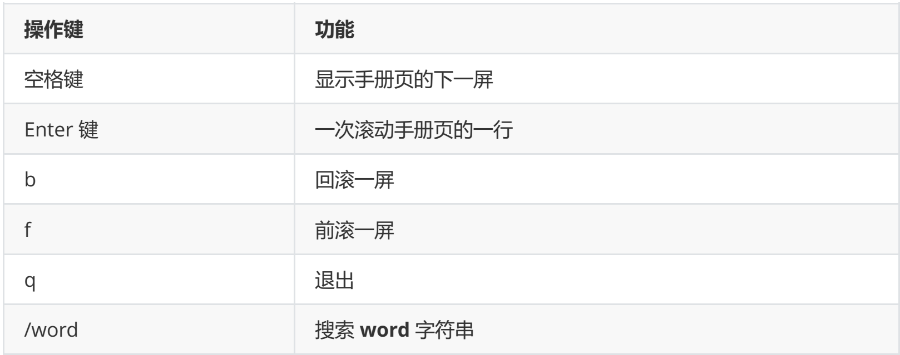

---

title: Linux命令全教程
author: 橙子草
date: 2023-10-10 10:40:40
tags:
- Linux
categories: 
- 教程
top_img: https://pic.imgdb.cn/item/64d88a7d1ddac507ccaa08bf.webp
cover: https://pic.imgdb.cn/item/64d88a7d1ddac507ccaa08bf.webp

---

## Linux终端命令格式

### 终端命令格式

```shell
command [-options] [parameter]
```

**说明：**

- command ：命令名，相应功能的英文单词或单词的缩写
- [-options] ：选项，可用来对命令进行控制，也可以省略
- parameter ：传给命令的**参数**，可以是 零个、一个 或者 多个

### 查阅命令帮助信息

#### -help

说明：

- 显示 command 命令的帮助信息

#### -man

说明：

- 查阅 command 命令的使用手册 man 是 manual 的缩写，是 Linux 提供的一个 手册，包含了绝大部分的命令、函数的详细使用
- 说明 使用 man 时的操作键 



## 常用Linux命令的基本实用

### 学习Linux终端命令的原因

- Linux 刚面世时并没有图形界面，所有的操作全靠命令完成，如**磁盘操作、文件存取、目录操作、进程管理、文件权限** 设定等
- 在职场中，大量的 [**服务器**](https://cloud.tencent.com/act/pro/promotion-cvm?from_column=20065&from=20065)**维护**工作 都是在 **远程** 通过 **SSH** 客户端 来完成的，并没有图形界面，所有的维护工作都需要通过命令来完成
- 在职场中，作为后端程序员，必须要或多或少的掌握一些 Linux 常用的终端命令
- Linux 发行版本的命令大概有 200 多个，但是常用的命令只有 10 多个而已

### 常用Linux命令的基本使用

| 序号 | 命令          | 对应英文             | 作用                     |
| :--- | :------------ | :------------------- | :----------------------- |
| 01   | ls            | list                 | 查看当前文件夹下的内容   |
| 02   | pwd           | print work directory | 查看当前所在文件夹       |
| 03   | cd[目录名]    | changge directory    | 切换文件夹               |
| 04   | touch[文件名] | touch                | 如果文件不存在，新建文件 |
| 05   | mkdir[目录名] | make directory       | 创建目录                 |
| 06   | rm[文件名]    | remove               | 删除指定文件             |
| 07   | clear         | clear                | 清屏                     |

**小技巧：**

- `ctrl + shift + =` **放大**终端窗口的字体显示
- `ctrl + -` **缩小**终端窗口的字体显示

### 自动补全

在敲出 `文件` ／ `目录` ／ `命令` 的前几个字母之后，按下 tab 键

- 如果输入的没有歧义，系统会自动补全
- 如果还存在其他 `文件` ／ `目录` ／ `命令` ，再按一下 tab 键，系统会提示可能存在的命令 **小技巧**
- 按 `上` ／ `下` 光标键可以在曾经使用过的命令之间来回切换
- 如果想要退出选择，并且不想执行当前选中的命令，可以按 `ctrl + c`

## 其它命令

### 查找文件

find 命令功能非常强大，通常用来在 特定的目录下 搜索 符合条件的文件

| 序号 | 命令                     | 作用                                          |
| :--- | :----------------------- | :-------------------------------------------- |
| 01   | find [路径] -name “*.py” | 查找指定路径下扩展名是 .py 的文件，包括子目录 |

- 如果省略路径，表示在当前文件夹下查找
- 之前学习的通配符，在使用 find 命令时同时可用

#### 演练目标

- 1.搜索桌面目录下，文件名包含 1 的文件

```shell
find -name "*1*"
```

- 2.搜索桌面目录下，所有以 .txt 为扩展名的文件

```shell
find -name "*.txt"
```

- 3.搜索桌面目录下，以数字 1 开头的文件

```shell
find -name "1*"
```

### 软链接

| 序 号 | 命令                          | 作用                                                        |
| :---- | :---------------------------- | :---------------------------------------------------------- |
| 01    | ln -s 被链接的源文件 链接文件 | 建立文件的软链接，用通俗的方式讲类似于 Windows 下的快捷方式 |

注意：

1. 没有 `-s` 选项建立的是一个 硬链接文件两个文件占用相同大小的硬盘空间，工作中**几乎不会建立文件的硬链接**
2. 源文件要**使用绝对路径**，不能使用相对路径，这样可以方便移动链接文件后，仍然能够正常使用

#### 演练目标

1. 将桌面目录下的 01.py 移动到 demo/b/c 目录下
2. 在桌面目录下新建 01.py 的 软链接 FirstPython分别使用 相对路径 和 绝对路径 建立 FirstPython 的软链接
3. 将 FirstPython 移动到 demo 目录下，对比使用 相对路径 和 绝对路径 的区别

#### 硬链接简介（知道）

在使用 ln 创建链接时，如果没有 -s 选项，会创建一个 硬链接，而不是软链接

#### 硬链接演练

1. 在 `~/Desktop/demo` 目录下建立 `~/Desktop/demo/b/c/01.py` 的硬链接 `01_hard`
2. 使用 ls -l 查看文件的硬链接数（硬链接——有多少种方式可以访问文件或者目录）
3. 删除 `~/Desktop/demo/b/c/01.py` ，并且使用 tree 来确认 demo 目录下的三个链接文件文件软硬链接的示意图

#### 文件软硬链接示意图



 在 Linux 中，文件名 和 文件的数据 是分开存储的

- 提示： 在 Linux 中，只有文件的 `硬链接数` == 0 才会被删除 使用 `ls -l` 可以查看一个文件的硬链接的数量 在日常工作中，几乎不会建立文件的硬链接，知道即可

### 打包压缩

- 打包压缩 是日常工作中备份文件的一种方式
- 在不同操作系统中，常用的打包压缩方式是不同的选项 含义 Windows 常用 rar Mac 常用 zip Linux 常用 tar.gz

#### 打包 ／ 解包

`tar` 是 Linux 中最常用的 **备份**工具，此命令可以 **把一系列文件** 打包到 一个**大文件**中，也可以把一个 打包的大文件恢复成一系列文件 `tar` 的命令格式如下:

```shell
# 打包文件
tar -cvf 打包文件.tar 被打包的文件／路径...
# 解包文件
tar -xvf 打包文件.tar
```

**tar选项说明：**

| 选项 | 含义                                                         |
| :--- | :----------------------------------------------------------- |
| c    | 生成档案文件，创建打包文件                                   |
| x    | 解开档案文件                                                 |
| v    | 列出归档解档的详细过程，显示进度                             |
| f    | 指定档案文件名称，f 后面一定是 .tar 文件，所以必须放选项最后 |

注意： **f 选项必须放在最后，其他选项顺序可以随意**

### 压缩／解压缩

#### 1）gzip

- tar 与 gzip 命令结合可以使用实现文件 打包和压缩 tar 只负责打包文件，但不压缩 用 gzip 压缩 tar 打包后的文件，其扩展名一般用 xxx.tar.gz

>  在 Linux 中，最常见的压缩文件格式就是 xxx.tar.gz 

- 在 tar 命令中有一个选项 -z 可以调用 gzip ，从而可以方便的实现压缩和解压缩的
- 功能命令格式如下：

```shell
# 压缩文件
tar -zcvf 打包文件.tar.gz 被压缩的文件／路径...
# 解压缩文件
tar -zxvf 打包文件.tar.gz
# 解压缩到指定路径
tar -zxvf 打包文件.tar.gz -C 目标路径
```

| 选项 | 含义                                           |
| :--- | :--------------------------------------------- |
| -C   | 解压缩到指定目录，注意：要解压缩的目录必须存在 |

#### 2) bzip2(two)

- tar 与 bzip2 命令结合可以使用实现文件 打包和压缩（用法和 gzip 一样） tar 只负责打包文件，但不压缩 用 bzip2 压缩 tar 打包后的文件，其扩展名一般用 xxx.tar.bz2
- 在 tar 命令中有一个选项 -j 可以调用 bzip2 ，从而可以方便的实现压缩和解压缩的功能
- 命令格式如下：

```shell
# 压缩文件
tar -jcvf 打包文件.tar.bz2 被压缩的文件／路径...
# 解压缩文件
tar -jxvf 打包文件.tar.bz2
```

### 软件安装

#### 通过 apt 安装／卸载软件

- apt 是 `Advanced Packaging Tool` ，是 Linux 下的一款安装包管理工具
- 可以在终端中方便的 **安装／卸载／更新软件包**

```shell
# 1. 安装软件
$ sudo apt install 软件包
# 2. 卸载软件
$ sudo apt remove 软件名
# 3. 更新已安装的包
$ sudo apt upgrade
```

## 文件和目录常用命令

### 查看目录内容

#### ls 命令说明

- ls 是英文单词 list 的简写，其功能为列出目录的内容，是用户最常用的命令之一，类似于 DOS下的 dir 命令

#### Linux 下文件和目录的特点

- Linux 文件 或者 目录 名称最长可以有 256 个字符参数 含义
- 以 . 开头的文件为隐藏文件，需要用 -a 参数才能显示
- . 代表当前目录
- … 代表上一级目录

#### ls 常用选项

| 参数 | 含义                                         |
| :--- | :------------------------------------------- |
| -a   | 显示指定目录下所有子目录与文件，包括隐藏文件 |
| -l   | 以列表方式显示文件的详细信息                 |
| -h   | 配合 -l 以人性化的方式显示文件大小           |

#### ls通配符的使用

| 通配符 | 含义                                 |
| :----- | :----------------------------------- |
| *      | 代表任意个数个字符                   |
| ?      | 代表任意一个字符，至少 1 个          |
| []     | 表示可以匹配字符组中的任一一个       |
| [abc]  | 匹配 a、b、c 中的任意一个            |
| [a-f]  | 匹配从 a 到 f 范围内的的任意一个字符 |

注意：以 . 开头的文件为隐藏文件，需要用 -a 参数才能显示

### 切换目录

#### cd

`cd` 是英文单词 change directory 的简写，其功能为更改当前的工作目录，也是用户**最常用的命令之一** 注意：Linux 所有的 目录 和 文件名 都是大小写敏感的

| 命令 | 含义                                   |
| :--- | :------------------------------------- |
| cd   | 切换到当前用户的主目录(/home/用户目录) |
| cd ~ | 切换到当前用户的主目录(/home/用户目录) |
| cd . | 保持在当前目录不变                     |
| cd … | 切换到上级目录                         |
| cd – | 可以在最近两次工作目录之间来回切换     |

#### 相对路径和绝对路径

相对路径 在输入路径时，最前面不是 / 或者 ~，表示相对 当前目录 所在的目录位置 绝对路径 在输入路径时，最前面是 / 或者 ~，表示从 **根目录/家目录** 开始的具体目录位置

### 创建和删除操作

#### touch

- 创建文件或修改文件时间 如果文件 不存在，可以创建一个空白文件 如果文件 已经存在，可以修改文件的末次修改日期

#### mkdir

- 创建一个新的目录

| 选项 | 含义             |
| :--- | :--------------- |
| -p   | 可以递归创建目录 |

**新建目录的名称 不能与当前目录中 已有的目录或文件 同名**

#### rm

- 删除文件或目录 使用 rm 命令要小心，因为文件删除后不能恢复

| 选项 | 含义                                              |
| :--- | :------------------------------------------------ |
| -f   | 强制删除，忽略不存在的文件，无需提示              |
| -r   | 递归地删除目录下的内容，删除文件夹 时必须加此参数 |

### 拷贝和移动文件

| 序号 | 命令               | 对应英文 | 作用                                 |
| :--- | :----------------- | :------- | :----------------------------------- |
| 01   | tree [目录名]      | tree     | 以树状图列出文件目录结构             |
| 02   | cp 源文件目标文件  | copy     | 复制文件或者目录                     |
| 03   | mv 源文件 目标文件 | move     | 移动文件或者目录／文件或者目录重命名 |

#### tree

- tree 命令可以以树状图列出文件目录结构

| 选项 | 含义       |
| :--- | :--------- |
| -d   | 只显示目录 |

#### cp

- cp 命令的功能是将给出的 **文件 或 目录** 复制到另一个 **文件 或 目录** 中，相当DOS 下的 copy命令

| 选 项 | 含义                                                         |
| :---- | :----------------------------------------------------------- |
| -i    | 覆盖文件前提示                                               |
| -r    | 若给出的源文件是目录文件，则 cp 将递归复制该目录下的所有子目录和文件，目标文件必 |

须为一个目录名

#### mv

- mv 命令可以用来 移动 文件 或 目录，也可以给 文件或目录重命名

| 选项 | 含义           |
| :--- | :------------- |
| -i   | 覆盖文件前提示 |

### 查看文件内容

| 序 号 | 命令                 | 对应英文    | 作用                                                 |
| :---- | :------------------- | :---------- | :--------------------------------------------------- |
| 01    | cat 文件名           | concatenate | 查看文件内容、创建文件、文件合并、追加文件内容等功能 |
| 02    | more 文件名          | more        | 分屏显示文件内容                                     |
| 03    | grep 搜索文本 文件名 | grep        | 搜索文本文件内容                                     |

#### cat

cat 命令可以用来 查看文件内容、创建文件、文件合并、追加文件内容 等功能 cat 会一次显示所有的内容，适合 查看内容较少 的文本文件

| 选项 | 含义               |
| :--- | :----------------- |
| -b   | 对非空输出行编号   |
| -n   | 对输出的所有行编号 |

Linux 中还有一个 nl 的命令和 cat -b 的效果等价

#### more

- more 命令可以用于分屏显示文件内容，每次只显示一页内容
- 适合于 查看内容较多的文本文件

使用 more 的操作键：

| 操作键 | 功能                    |
| :----- | :---------------------- |
| 空格键 | 显示手册页的下一屏      |
| Enter  | 键 一次滚动手册页的一行 |
| b      | 回滚一屏                |
| f      | 前滚一屏                |
| q      | 退出                    |
| /word  | 搜索 word 字符串        |

#### grep

Linux 系统中 grep 命令是一种强大的文本搜索工具 grep 允许对文本文件进行 模式查找，所谓模式查找，又被称为正则表达式。

| 选项 | 含义                                     |
| :--- | :--------------------------------------- |
| -n   | 显示匹配行及行号                         |
| -v   | 显示不包含匹配文本的所有行（相当于求反） |
| -i   | 忽略大小写                               |

常用的两种模式查找

| 参数 | 含义                     |
| :--- | :----------------------- |
| ^a   | 行首，搜寻以 a 开头的行  |
| ke$  | 行尾，搜寻以 ke 结束的行 |

### 其他

#### echo 文字内容

echo 会在终端中显示参数指定的文字，通常会和 重定向 联合使用

#### 重定向 > 和 >>

Linux 允许将命令执行结果 重定向到一个 文件 将本应显示在终端上的内容 输出／追加 到指定文件中 其中 **> 表示输出，会覆盖文件原有的内容** **>> 表示追加，会将内容追加到已有文件的末尾**

#### 管道 |

- Linux 允许将 一个命令的输出 可以通过管道 做为 另一个命令的输入
- 可以理解现实生活中的管子，管子的一头塞东西进去，另一头取出来，这里 | 的左右分为两端， 左端塞东西（写），右端取东西（读）

常用的管道命令有：

- more ：分屏显示内容
- grep ：在命令执行结果的基础上查询指定的文本

## 系统信息相关命令

### 时间和日期

| 序号 | 命令 | 作用                                          |
| :--- | :--- | :-------------------------------------------- |
| 01   | date | 查看系统时间                                  |
| 02   | cal  | calendar 查看日历， -y 选项可以查看一年的日历 |

### 磁盘信息

| 序号 | 命令           | 作用                            |
| :--- | :------------- | :------------------------------ |
| 01   | df -h          | disk free 显示磁盘剩余空间      |
| 02   | du -h [目录名] | disk usage 显示目录下的文件大小 |

### 进程信息

所谓**进程**，通俗地说就是 **当前正在执行的一个程序**

| 序号 | 命令               | 作用                                 |
| :--- | :----------------- | :----------------------------------- |
| 01   | ps aux             | process status 查看进程的详细状况    |
| 02   | top                | 动态显示运行中的进程并且排序         |
| 03   | kill [-9] 进程代号 | 终止指定代号的进程， -9 表示强行终止 |

ps 默认只会显示当前用户通过终端启动的应用程序 ps 选项说明

| 选项 | 含义                                     |
| :--- | :--------------------------------------- |
| a    | 显示终端上的所有进程，包括其他用户的进程 |
| u    | 显示进程的详细状态                       |
| x    | 显示没有控制终端的进程                   |

提示：使用 kill 命令时，最好只终止由当前用户开启的进程，而不要终止 root 身份开启的进程，否则可能导致系统崩溃

- 要退出 top 可以直接输入 q

## 用户权限相关命令

### 组管理

提示：创建组 / 删除组 的终端命令都需要通过 sudo 执行

| 序号 | 命令                      | 作用                      |
| :--- | :------------------------ | :------------------------ |
| 01   | groupadd 组名             | 添加组                    |
| 02   | groupdel 组名             | 删除组                    |
| 03   | cat /etc/group            | 确认组信息                |
| 04   | chgrp -R 组名 文件/目录名 | 递归修改文件/目录的所属组 |

提示： 组信息保存在 /etc/group 文件中 /etc 目录是专门用来保存 系统配置信息 的目录

### 用户管理

提示：创建用户 / 删除用户 / 修改其他用户密码 的终端命令都需要通过 sudo 执行

#### 创建用户／设置密码／删除用户



 提示：

- 创建用户时，如果忘记添加 -m 选项指定新用户的家目录 —— 最简单的方法就是删除用户，重新创建
- 创建用户时，默认会创建一个和用户名同名的组名
- 用户信息保存在 /etc/passwd 文件中

#### 查看用户信息

| 序号 | 命令        | 作用                       |
| :--- | :---------- | :------------------------- |
| 01   | id [用户名] | 查看用户 UID 和 GID 信息   |
| 02   | who         | 查看当前所有登录的用户列表 |
| 03   | whoami      | 查看当前登录用户的账户名   |

##### which（重要）

提示

- /etc/passwd 是用于保存用户信息的文件
- /usr/bin/passwd 是用于修改用户密码的程序 which 命令可以查看执行命令所在位置，例如：

```shell
which ls
# 输出
# /bin/ls
which useradd
# 输出
# /usr/sbin/useradd
```

**bin 和 sbin**

- 在 Linux 中，绝大多数可执行文件都是保存在 /bin 、 /sbin 、 /usr/bin 、 /usr/sbin
- /bin （ binary ）是二进制执行文件目录，主要用于具体应用
- /sbin （ system binary ）是系统管理员专用的二进制代码存放目录，主要用于系统管理
- /usr/bin （ user commands for applications ）后期安装的一些软件
- /usr/sbin （ super user commands for applications ）超级用户的一些管理程序

提示： cd 这个终端命令是内置在系统内核中的，没有独立的文件，因此用 which 无法找到 cd命令的位置

#### 切换用户

| 序 号 | 命令        | 作用                   | 说明                                     |
| :---- | :---------- | :--------------------- | :--------------------------------------- |
| 01    | su – 用户名 | 切换用户，并且切换目录 | – 可以切换到用户家目录，否则保持位置不变 |
| 02    | exit        | 退出当前登录账户       |                                          |

su 不接用户名，可以切换到 root ，但是不推荐使用，因为不安全 exit 示意图如下：

### 修改文件权限

| 序号 | 命令  | 作用       |
| :--- | :---- | :--------- |
| 01   | chown | 修改拥有者 |
| 02   | chgrp | 修改组     |
| 03   | chmod | 修改权限   |

命令格式如下：

```shell
# 修改文件|目录的拥有者
chown 用户名 文件名|目录名
# 递归修改文件|目录的组
chgrp -R 组名 文件名|目录名
# 递归修改文件权限
chmod -R 755 文件名|目录名
```

## 远程管理常用命令

### 关机/重启

| 序号 | 命令     | 对应英文           | 作用           |
| :--- | :------- | :----------------- | :------------- |
| 01   | shutdown | 选项 时间 shutdown | 关机／重新启动 |

常用命令示例

```shell
# 重新启动操作系统，其中 now 表示现在
$ shutdown -r now
# 立刻关机，其中 now 表示现在
$ shutdown now
# 系统在今天的 20:25 会关机
$ shutdown 20:25
# 系统再过十分钟后自动关机
$ shutdown +10
# 取消之前指定的关机计划
$ shutdown -c
```

不指定选项和参数，默认表示 1 分钟之后 关闭电脑 远程维护服务器时，最好不要关闭系统，而应该重新启动系统

### 查看配置网卡信息

| 序 号 | 命令        | 对应英文                      | 作用                              |
| :---- | :---------- | :---------------------------- | :-------------------------------- |
| 01    | ifconfig    | configure a network interface | 查看/配置计算机当前的网卡配置信息 |
| 02    | ping ip地址 | ping                          | 检测到目标 ip地址 的连接是否正常  |

#### ifconfig

ifconfig 可以查看／配置计算机当前的网卡配置信息

```shell
# 查看网卡配置信息
$ ifconfig
# 查看网卡对应的 IP 地址
$ ifconfig | grep inet
```

提示：一台计算机中有可能会有一个 物理网卡 和 多个虚拟网卡，在 Linux 中物理网卡的名字通常以 ensXX 表示 127.0.0.1 被称为 **本地回环/环回地址**，一般用来测试本机网卡是否正常

#### ping

ping 一般用于检测当前计算机到目标计算机之间的网络 **是否通畅，数值越大，速度越慢**

```shell
# 检测到目标主机是否连接正常
$ ping IP地址
# 检测本地网卡工作正常
$ ping 127.0.0.1
```

ping 的工作原理与潜水艇的声纳相似， ping 这个命令就是取自 声纳的声音 网络管理员之间也常将 ping 用作动词 —— ping 一下计算机X，看他是否开着

### 远程登录和赋值文件



#### ssh 基础（重点）

在 Linux 中 SSH 是 **非常常用** 的工具，通过 **SSH 客户端** 我们可以连接到运行了 **SSH 服务器** 的远程机器上 



 ssh的简单使用：

```shell
ssh [-p port] user@remote
```

复制

- user 是在远程机器上的用户名，如果不指定的话默认为当前用户
- remote 是远程机器的地址，可以是 IP／[域名](https://cloud.tencent.com/act/pro/domain-sales?from_column=20065&from=20065)，或者是 后面会提到的别名
- port 是 SSH Server 监听的端口，如果不指定，就为默认值 22

提示：

- 使用 exit 退出当前用户的登录
- ssh 这个终端命令只能在 Linux 或者 UNIX 系统下使用
- 如果在 Windows 系统中，可以安装 PuTTY 或者 XShell 客户端软件即可
- 在工作中，SSH 服务器的端口号很有可能**不是 22**，如果遇到这种情况就需要**使用 -p 选项**，指定正确的端口号，否则无法正常连接到服务器

#### scp

scp 就是 secure copy ，是一个在 Linux 下用来进行 **远程拷贝文件** 的命令 它的**地址格式与 ssh 基本相同**，需要注意的是，在指定端口时用的是大写的 -P 而不是小写的

```shell
# 把本地当前目录下的 01.py 文件 复制到 远程 家目录下的 Desktop/01.py
# 注意：`:` 后面的路径如果不是绝对路径，则以用户的家目录作为参照路径
scp -P port 01.py user@remote:Desktop/01.py
# 把远程 家目录下的 Desktop/01.py 文件 复制到 本地当前目录下的 01.py
scp -P port user@remote:Desktop/01.py 01.py
# 加上 -r 选项可以传送文件夹
# 把当前目录下的 demo 文件夹 复制到 远程 家目录下的 Desktop
scp -r demo user@remote:Desktop
# 把远程 家目录下的 Desktop 复制到 当前目录下的 demo 文件夹
scp -r user@remote:Desktop demo
```

| 选 项 | 含义                                                         |
| :---- | :----------------------------------------------------------- |
| -r    | 若给出的源文件是目录文件，则 scp 将递归复制该目录下的所有子目录和文件，目标文件必须为一个目录名 |
| -P    | 若远程 SSH 服务器的端口不是 22，需要使用大写字母 -P 选项指定端口 |

注意： scp 这个终端命令只能在 `Linux` 或者 `UNIX` 系统下使用 如果在 Windows 系统中，可以安装 PuTTY ，使用 pscp [命令行工具](https://cloud.tencent.com/product/cli?from_column=20065&from=20065)或者安装 FileZilla使用 FTP 进行文件传输
