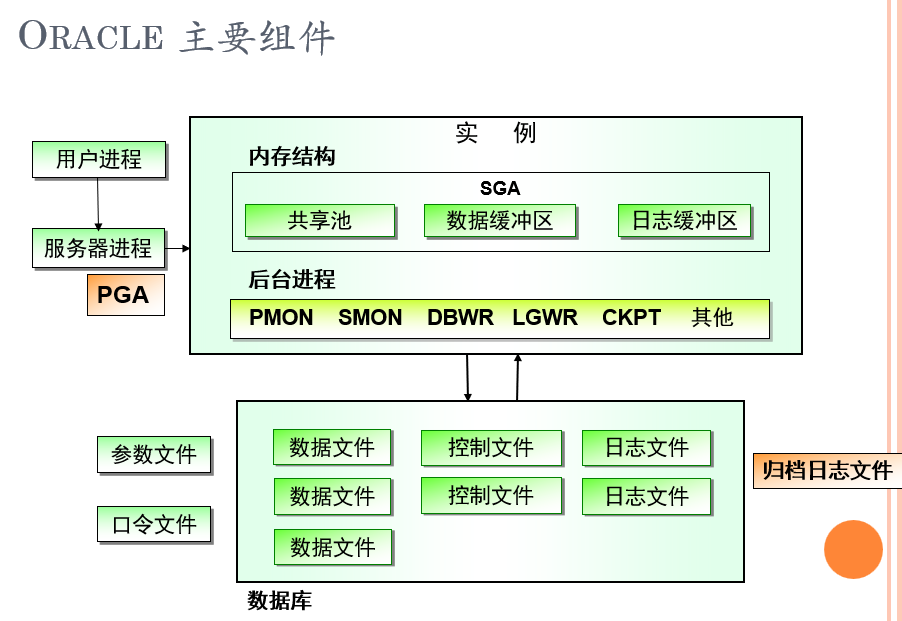
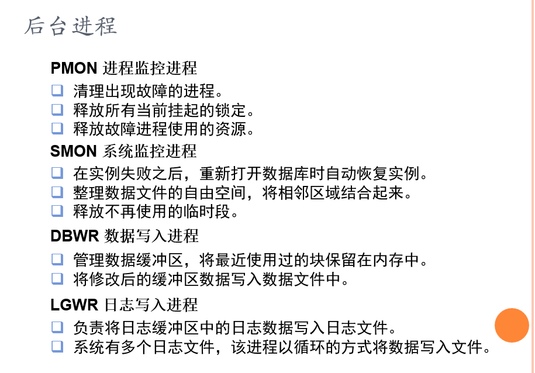

#### 大型数据库开发


##### 1. ORACLE的实例内存结构

- SGA的内部构成？ 知道里头几个核心部件分别做什么？（java pool, large pool,  data buffer cache ,log buffer）

  ```
  SGA包括共享池，数据缓冲区，日志缓冲区三个区域
  共享池(shared pool) ：用来存储最近执行的SQL语句和最近使用的数据字典的数据
  数据缓冲区 (database buffer cache)：用来存储最近从数据文件中读写过的数据。
  日志缓冲区(redo log buffer)：用来记录服务或后台进程对数据库的操作。
  为了提高效率，数据从磁盘文件，读取到SGA中的数据高速缓冲区以提高访问效率
  Java pool：保存java虚拟机中特定会话的数据与java代码。
  Large pool：一个可选的区域，用来缓存大的I/O请求，以支持并行查询、共享服务器模式以及某些备份操作。
  Data buffer cache：缓存了从磁盘上检索的数据块。
  log buffer：缓存了写到磁盘。
  ```

  

- 简述oracle三种进程

  ```
  Oracle有三种实例进程，分别是用户进程，服务器进程和后台进程。
  用户进程是一个需要与Oracle服务器进行交互的程序。当用户运行一个应用程序准备向数据库服务器发送请求时，即创建了用户进程
  服务器进程用于处理连接到该实例的用户进程的请求。当用户连接至 Oracle 数据库实例创建会话时，即产生服务器进程
  后台进程是Oracle数据库为了保持最佳系统性能和协调多个用户请求而设置的。 Oracle 实例启动时即创建一系列后台进程
  PMON:进程监视器 
  SMON：系统监视器 
  DBWR：数据写入过程
  LGWR：日志写入过程
  CKPT：设置检查点
  ```

  

- 简述oracle服务器构成以及各种数据文件的作用

  ```
  Oracle数据库
  数据文件  *.dbf
  控制文件  *.ctl
  日志文件  *.log
  Oracle实例(超级缓存SGA+进程(如PMON等))；
  Oracle 数据库是一个数据的集合，该集合被视为一个逻辑单元,管理数据库的后台进程和内存结构的集合称为Oracle实例 
  ```


##### 2.  ORACLE数据库的逻辑结构

- 逻辑结构： 表空间， 如何创建表空间

```
CREATE TABLESPACE tablespacename
```

- 构建一个用户，其默认表空间是什么？

```
  名为SYSTEM的系统表空间。
```

表空间-> 段 -> 区 -> 数据块 ->os块     

```
表空间是数据库中最大的逻辑单位，一个 Oracle 数据库至少包含一个表空间。
段是构成表空间的逻辑存储结构，段由一组区组成。
区为段分配空间，它由连续的数据块组成。
数据块是Oracle服务器所能分配、读取或写入的最小存储单元。
Oracle的表空间由若干的数据文件(OS级)所组成。一个表空间最多可以有1024个数据文件组成。
```

##### 3.  ORACLE数据字典

     dba_users 查看用户信息  select * from dba_users...
     dba_tables
     user_tables
     user_sequences 用户序列表
     .....

##### 4.  ORACLE数据库的物理结构

数据文件  *.dbf
控制文件  *.ctl
日志文件  *.log
分别作用是什么？   哪个文件来记录存档的重做日志信息

```
数据文件用于存储数据库数据，如表、索引数据等。
控制文件是记录数据库物理结构的二进制文件。
日志文件记录对数据库的所有修改信息，用于故障恢复
```


##### 5.   基本DDL语句
      create table 
      create view
      create sequence 自增序列
      create index 创建索引
      create procedure 创建存储过程
      ....

##### 6.   oracle sequence的常见操作

      currval , nextval

##### 7.    常见约束的使用和使用场景  选择题

      主键约束，外键，唯一，检查  ....

##### 8.    ORACLE游标
概念、常见类型

```
隐式游标：在PL/SQL中使用DML语句时自动创建隐式游标
显式游标：显式游标在 PL/SQL 块的声明部分定义查询，该查询可以返回多行
循环游标：用于简化游标处理代码
REF 游标：REF 游标和游标变量用于处理运行时动态执行的 SQL 查询
```


##### 9.    ORACLE常见包

    输出包，随机数字生成包（dbms_random）

##### 10.  ORACLE JDBC操作
    会编程

##### 11.  理解Oracle执行计划

    知道是什么，以及其它基本操作流程，懂的简单解读执行计划

##### 12.  ORACLE登录系统的命令

    sqlplus /nolog
    sqlplus sys/manager as sysdba
    connect sys/manager as sysdba

##### 13.   ORACLE启动和关闭命令
    startup 
    startup nomount
    shutdown
    shutdown immedate

##### 14.  常见的sqlplus命令

    set serveroutput on

##### 15.  oracle创建用户和授权以及取消授权命令

- 输入创建语句。create user 用户名 identified by 密码;

  ```
  create user user1 identified by 123456;
  ```
  
-  授权给用户

  ```
  grant connect, resource to user1;
  ```

- 撤销对user1赋予的权限

  ```
  revoke connect, resource from user1;
  ```

##### 16.  存储过程，游标
- 存储过程和游标的优缺点

  ```
  存储过程的优点：
  	存储过程是一个预编译的代码块，执行效率比较高
  	存储过程在服务器端运行，减少客户端的压力
  	允许模块化程序设计，只需要创建一次过程，以后在程序中就可以调用该过程任意次，类似方法的复用
  	一个存储过程替代大量T_SQL语句 ，可以降低网络通信量，提高通信速率
  	可以一定程度上确保数据安全
  存储过程的缺点：
  	调试麻烦（没有像开发程序那样容易）
  	可移植性不灵活（因为存储过程依赖于具体的数据库）
  
  游标变量的优点有：
     可从不同的 SELECT 语句中提取结果集
     可以作为过程的参数进行传递
     可以引用游标的所有属性
     可以进行赋值运算
  使用游标变量的限制：
     不能在程序包中声明游标变量
     FOR UPDATE子句不能与游标变量一起使用
     不能使用比较运算符
  ```
  
  
  
  

