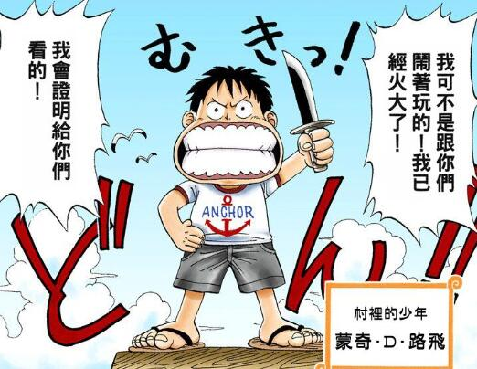
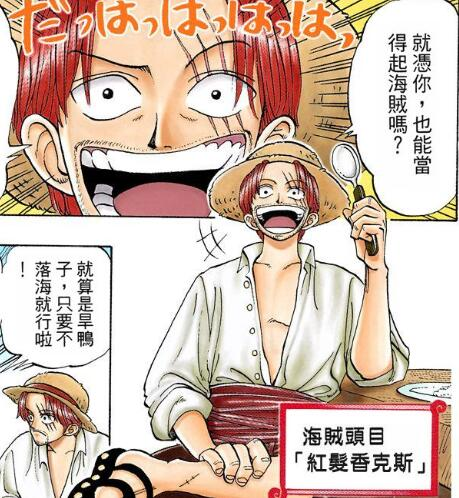
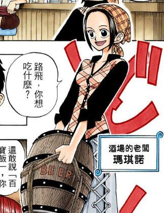
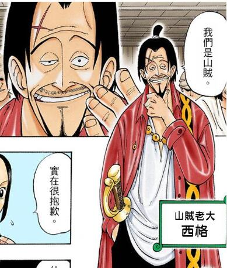
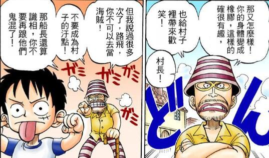
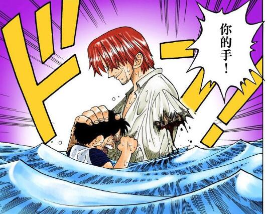
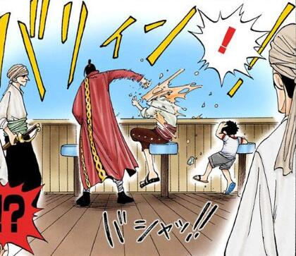

> 放在开头的话

## 东海篇 :Vol.1-Vol.12

### 风车村篇（路飞启程）:Vol.1
#### 相关视频

<iframe src="//player.bilibili.com/player.html?aid=54508662&bvid=BV154411H7hc&cid=95341349&page=1" scrolling="no" border="0" frameborder="no" framespacing="0" allowfullscreen="true"> </iframe>

#### 主要登场人物
#####  路飞



##### 红发



##### 玛琪诺



##### 山贼王 西格



##### 风车村村长-乌普史拉布




#### 剧情介绍





#### 本篇名场面











---
### 巴基篇（索隆上船）:Vol.1-Vol.3

#### 主要登场人物

#### 剧情介绍

#### 经典画面

#### 相关影片

#### 人物简介

### 乌索普上船篇 ：Vol.3-Vol.5

#### 主要登场人物

#### 剧情介绍

#### 经典画面

#### 相关影片

#### 人物简介

### 海上餐厅篇（山治上船）Vol.5-Vol.8

#### 主要登场人物

#### 剧情介绍

#### 经典画面

#### 相关影片

#### 人物简介

### 阿龙篇（娜美正式上船）Vol.8-Vol.11

#### 主要登场人物

#### 剧情介绍

#### 经典画面

#### 相关影片

#### 人物简介

### 罗格镇篇 Vol.11-Vol.12

#### 主要登场人物

#### 剧情介绍

#### 经典画面

#### 相关影片

#### 人物简介

## 阿拉巴斯坦篇 :Vol.12-Vol.23
### 威⼠忌⼭峰篇 : Vol.12-Vol.13

#### 主要登场人物

#### 剧情介绍

#### 经典画面

#### 相关影片

#### 人物简介

### ⼩花园篇 : Vol.13-Vol.15

#### 主要登场人物

#### 剧情介绍

#### 经典画面

#### 相关影片

#### 人物简介

### 磁⿎王国篇（乔巴上船）:Vol.15-Vol.17

#### 主要登场人物

#### 剧情介绍

#### 经典画面

#### 相关影片

#### 人物简介

### 阿拉巴斯坦篇 : Vol.17-Vol.24

#### 主要登场人物

#### 剧情介绍

#### 经典画面

#### 相关影片

#### 人物简介

## 空岛篇 : Vol.24-Vol.32
### 加雅岛篇 : Vol.24-Vol.25
### 空岛篇 : Vol.25-Vol.32

## 长链岛篇:Vol.32-Vol.34
